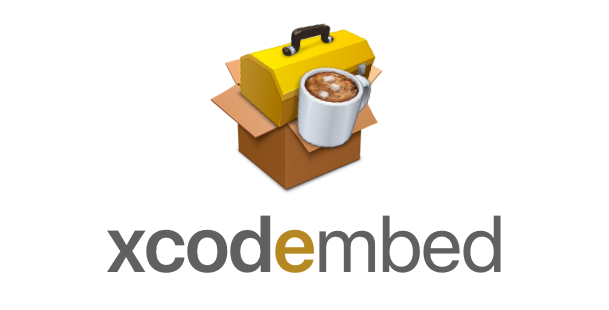

<p align="center">
<a href="https://github.com/swift-xcode/xcode">

</a>
</p>
<p align="center">
  
  <a href="https://github.com/swift-xcode/xcode/releases">
    
  </a>
  <a href="https://travis-ci.org/swift-xcode/xcode">
    
  </a>
  <a href="https://github.com/swift-xcode/xcode/blob/master/LICENSE">
    
  </a>
</p>

A set of command line tools to interact with your Xcode projects.

## Install

You can easily install xcode with Homebrew:

```
brew tap swift-xcode/xcode git@github.com:swift-xcode/xcode.git
brew install xcode 
```

## Setup

1. Git clone the repository `git clone git@github.com:swift-xcode/xcode.git`
2. Build with `swift build`

## Usage

You can check the available commands by just running `xcode` from the console.

#### Frameworks

##### Embed
It embeds your frameworks, their symbols, and the bcsymbolmap files into your built product stripping all the unnecessary architectures. This command should be used from a Xcode build phase as shown in the screenshot below:


## References

- [Speeding Up Custom Script Phases](http://indiestack.com/2014/12/speeding-up-custom-script-phases/)
- [Carthage copy frameworks](https://github.com/Carthage/Carthage/blob/master/Source/carthage/CopyFrameworks.swift)
- [CocoaPods embed frameworks script](https://github.com/CocoaPods/CocoaPods/blob/master/lib/cocoapods/generator/embed_frameworks_script.rb)
- [Commander](https://github.com/kylef/Commander)
- [PlistBuddy](https://developer.apple.com/legacy/library/documentation/Darwin/Reference/ManPages/man8/PlistBuddy.8.html)

## License

```
MIT License

Copyright (c) 2017 swift-xcode

Permission is hereby granted, free of charge, to any person obtaining a copy
of this software and associated documentation files (the "Software"), to deal
in the Software without restriction, including without limitation the rights
to use, copy, modify, merge, publish, distribute, sublicense, and/or sell
copies of the Software, and to permit persons to whom the Software is
furnished to do so, subject to the following conditions:

The above copyright notice and this permission notice shall be included in all
copies or substantial portions of the Software.

THE SOFTWARE IS PROVIDED "AS IS", WITHOUT WARRANTY OF ANY KIND, EXPRESS OR
IMPLIED, INCLUDING BUT NOT LIMITED TO THE WARRANTIES OF MERCHANTABILITY,
FITNESS FOR A PARTICULAR PURPOSE AND NONINFRINGEMENT. IN NO EVENT SHALL THE
AUTHORS OR COPYRIGHT HOLDERS BE LIABLE FOR ANY CLAIM, DAMAGES OR OTHER
LIABILITY, WHETHER IN AN ACTION OF CONTRACT, TORT OR OTHERWISE, ARISING FROM,
OUT OF OR IN CONNECTION WITH THE SOFTWARE OR THE USE OR OTHER DEALINGS IN THE
SOFTWARE.
```
